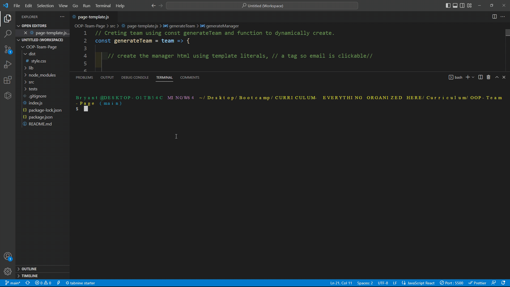
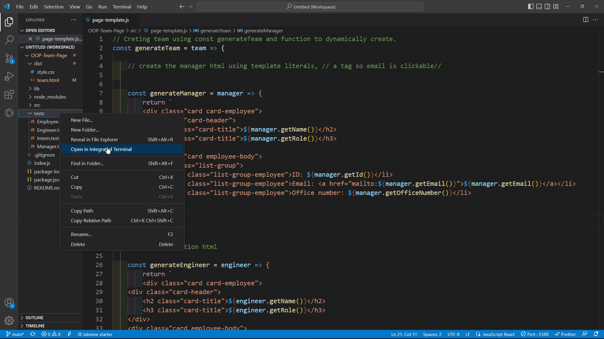

# <OOP-Team-Profile-Generator>

## Description

This project was created using OOP. By using OOP, we are able to dynamically generate employee cards based off of questions asked. Users are asked to give info on Manager, Engineer, and Intern. After User answers entire prompt, an index.html file will be created in which the new dynamically created employee cards will appear.

## Installation

First, the user must install inquiry in the integrated terminal and type in " npm i inquiry@8.2.4 "
Afterwards, user must install jest in the integrated terminal and type " npm install --save-dev jest" to run tests.

## Usage

Please follow the gif's provided to see step by step usage.

    

   

-----------------------------------------------------------------------------------------

Next, if user wants to run tests on the files in the "tests" folder, run the following command in terminal " npm run test"
You may also refer to gif provided below.

## License

None

## Features

By using OOP, we dynamically create employee cards that display different information about them.
This project was created using JavaScript, OOP, and minor CSS.

## How to Contribute

Anyone can contribute!
